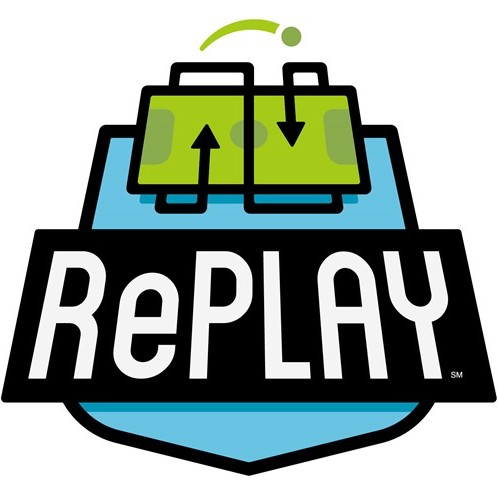

<a href="scorer/"> RePLAY Scorer</a> 
<a href="drawplan/"> RePLAY Sketch Planner</a>
 
 
<a href="https://docs.google.com/presentation/d/1ExB0ssQDjJ9od4YfqPYbvQHqjTr88ihIU9ntGsb_7Hw/view">IP Worksheets</a> 
 
<a href="https://docs.google.com/presentation/d/1PnNn2YYXbGBRo8o1VmTJxActQOz501SqhTqJsjvCo5c/edit?usp=sharing">RD Worksheets</a> 
 
<a href="https://docs.google.com/presentation/d/1fPb6y69poERtD0Ir7lafZzjOJNCAGvkKjpBwQDMTaIc/edit">CV Worksheets</a> 
 
href="https://docs.google.com/presentation/d/1Xe5ciByiaNYl9cTxmtulJzoCGRNlWZdhXuGmUaDDwLQ/edit">Mission Brainstorming</a> 
 
<a href="/translations/en-us/Worksheets/RePLAYGettingStarted.pdf">RePLAY Offseason</a>

